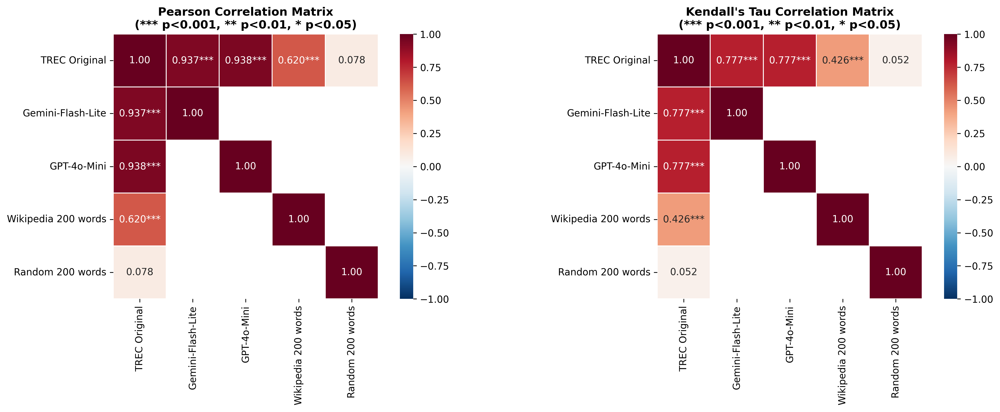
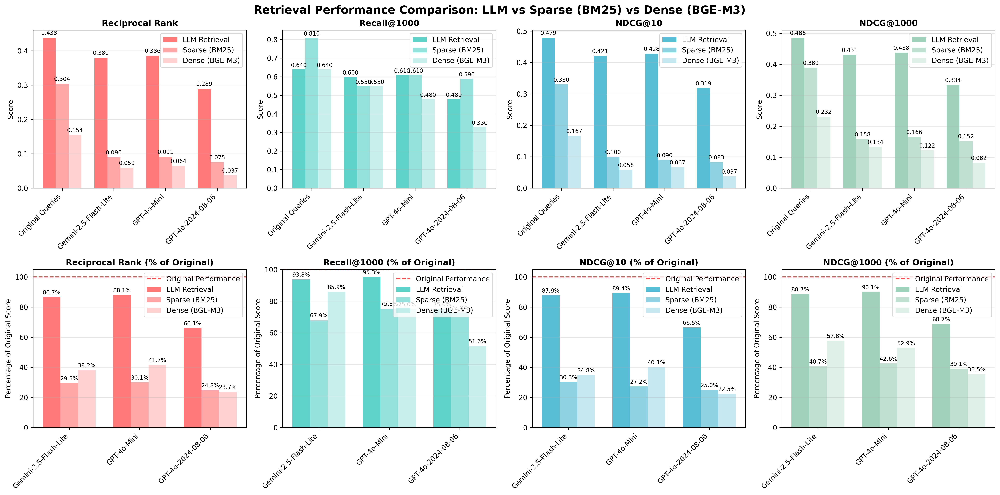
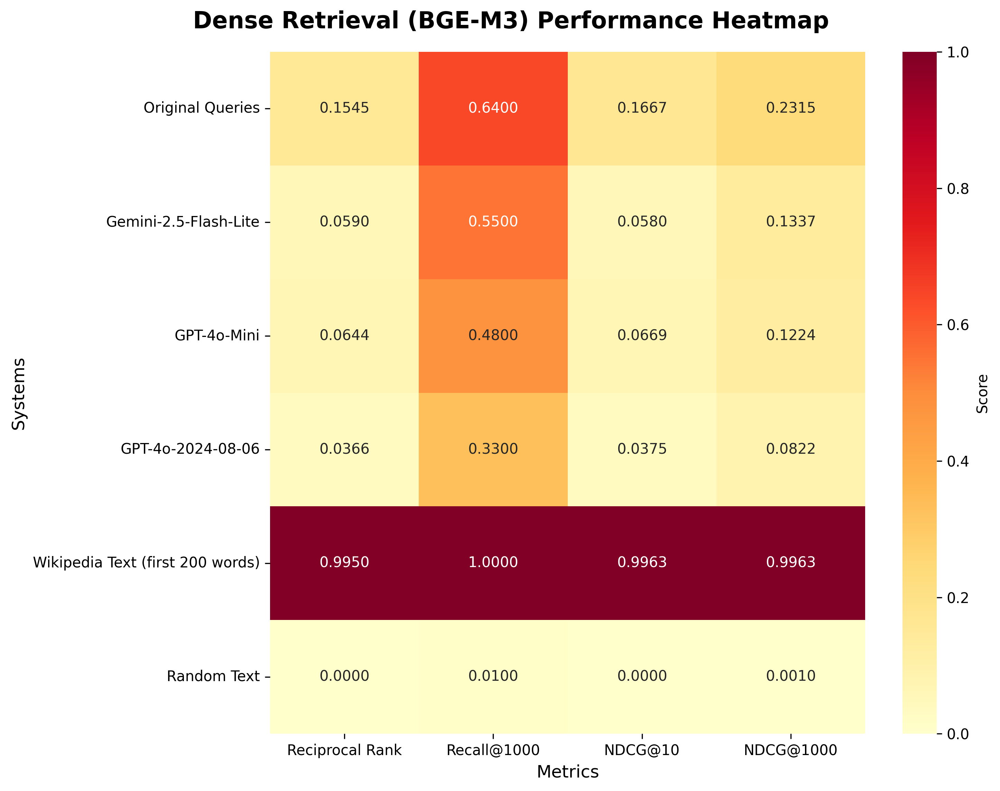

# Overview
- Reproduce LLM query generation from https://github.com/kimdanny/llm-tot-query-elicitation  
- Setup: test first 100 queries in dev3
- Compare queries generated from gemini-2.5-flash-lite, gpt-o4-mini and gpt-4o with the orignal trec queries using the following metrics
    - Query text embedding correlation
    - sparse retrieval results comparision
    - llm retrieval results comparision
- Also use two baselines for comparision
    - random 200 words
    - first 200 words of wikipedia pages


# Results
## 1. Correlation coeffients of query embeddings
Embedding model: all-MiniLM-L6-v2



Original vs. query from gemini-flash-lite
```
Pearson correlation: 0.9372  
Pearson P-value: 0.0000  
Kendall's Tau correlation: 0.7771  
Kendall's Tau P-value: 0.0000  
```

Original vs. query from gpt-4o-mini
```
Pearson correlation: 0.9375  
Pearson P-value: 0.0000  
Kendall's Tau correlation: 0.7772  
Kendall's Tau P-value: 0.0000  
```

Original vs. query from gpt-4o-2024-08-06
```
Pearson correlation: 0.9444
Pearson P-value: 0.0000
Kendall's Tau correlation: 0.7902
Kendall's Tau P-value: 0.0000
```

Original vs. query from first 200 words in Wikipedia page  
```
Pearson correlation: 0.6199  
Pearson P-value: 0.0000  
Kendall's Tau correlation set 1 and set 4: 0.4257
Kendall's Tau P-value: 0.0000
```

Original vs. random text 200 words
```
Pearson correlation: 0.0784
Pearson P-value: 0.1251
Kendall's Tau correlation: 0.0516
Kendall's Tau P-value: 0.1313
```

## TREC Evaluation Results




### LLM Retrieval Performance

Retrieval model config:
- gemini-2.5-flash
- context length: 5000
- temperature: 0

```
Original Queries:
  Reciprocal Rank: 0.4381
  Recall@1000:     0.6400
  NDCG@10:         0.4792
  NDCG@1000:       0.4862

Gemini-2.5-Flash-Lite:
  Reciprocal Rank: 0.3797
  Recall@1000:     0.6000
  NDCG@10:         0.4211
  NDCG@1000:       0.4311

GPT-4o-Mini:
  Reciprocal Rank: 0.3860
  Recall@1000:     0.6100
  NDCG@10:         0.4283
  NDCG@1000:       0.4382

GPT-4o-2024-08-06:
  Reciprocal Rank: 0.2895
  Recall@1000:     0.4800
  NDCG@10:         0.3185
  NDCG@1000:       0.3340
```

### PYTERRIER BM25 Retrieval Performance
```
Original Queries:
  Reciprocal Rank: 0.3038
  Recall@1000:     0.8100
  NDCG@10:         0.3302
  NDCG@1000:       0.3894

Gemini-2.5-Flash-Lite:
  Reciprocal Rank: 0.0896
  Recall@1000:     0.5500
  NDCG@10:         0.0999
  NDCG@1000:       0.1583

GPT-4o-Mini:
  Reciprocal Rank: 0.0913
  Recall@1000:     0.6100
  NDCG@10:         0.0899
  NDCG@1000:       0.1657

GPT-4o-2024-08-06:
  Reciprocal Rank: 0.0754
  Recall@1000:     0.5900
  NDCG@10:         0.0826
  NDCG@1000:       0.1524
```

### BGE-M3 Dense Retrieval Performance
```
Original Queries:
  Reciprocal Rank: 0.1545
  Recall@1000:     0.6400
  NDCG@10:         0.1667
  NDCG@1000:       0.2315

Gemini-2.5-Flash-Lite:
  Reciprocal Rank: 0.0590
  Recall@1000:     0.5500
  NDCG@10:         0.0580
  NDCG@1000:       0.1337

GPT-4o-Mini:
  Reciprocal Rank: 0.0644
  Recall@1000:     0.4800
  NDCG@10:         0.0669
  NDCG@1000:       0.1224

GPT-4o-2024-08-06:
  Reciprocal Rank: 0.0366
  Recall@1000:     0.3300
  NDCG@10:         0.0375
  NDCG@1000:       0.0822

Wikipedia Text (first 200 words):
  Reciprocal Rank: 0.9950
  Recall@1000:     1.0000
  NDCG@10:         0.9963
  NDCG@1000:       0.9963

Random Text:
  Reciprocal Rank: 0.0000
  Recall@1000:     0.0100
  NDCG@10:         0.0000
  NDCG@1000:       0.0010
```
